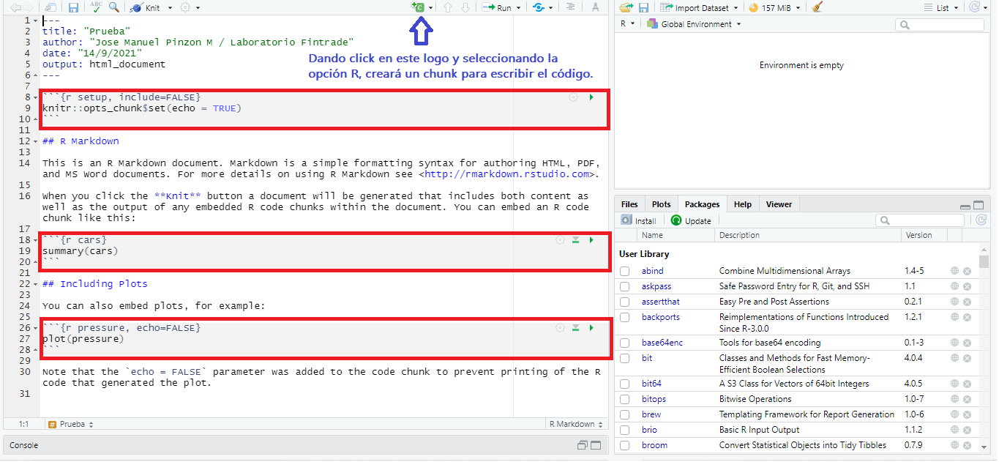

```{r setup, include=FALSE}
knitr::opts_chunk$set(echo = TRUE)
```

\pagebreak

**NOTA ACLARATORIA**: Esta guía aún se encuentra en construcción, no es la versión final, razón por la cual está sujeta a modificaciones. **Esta guía es exclusivamente para uso pedagógico**

## R Markdown

Uno de los formatos que contiene RStudio es R Markdown, acá se generan documentos mediante una interfaz que permite entrelazar texto narrativo y código para producir una salida con formato elegante. R Markdown permite variados formatos de salidas, incluidos HTML PDF, PDF, MS Word, diapositivas HTML, artículos científicos, entre otros.

Los archivos R Markdown están diseñados para usarse con el paquete "***rmarkdown***". Por esto, primero se debe instalar el paquete rmarkdown, una forma de hacerlo es ingresando el siguiente código.

```{r RMARK, eval=FALSE}
install.packages("rmarkdown")
```

### Crear R Markdown

Con el paquete rmarkdown instalado puede crear un nuevo archivo con extensión .Rmd, para hacer esto debe ir a las opciones que aparecen arriba de la interfaz "Rstudio", dar click en las opciones "File" -\> "New File" -\> "R markdown", también puede hacerlo como en el ejemplo de la figura 1. Luego de esto Rstudio le solicitará título, autor y formato de salida, ingrese en formato de salida html y de clic en **OK**. Si prefiere un pdf debe tener instalado **LATEX** en su equipo.

{height="280"}

Lo primero es el encabezado de su informe el cuál contiene: título, autor, fecha y formato de salida. Además va a encontrar un primer código entre tíldes o en un "Chunk", dicho código debe estar en el encabezado de todos los documentos. Mire la Figura 2.



El "Chunk" es el espacio donde usted le indicará a Rstudio el código o instrucción que quiere llevar a cabo. Lo que se encuentre por fuera de este chunk será tomado como texto. En la Figura 1 se encuentran resaltados los chunks y la manera de crearlos.

### Generar el informe

Por defecto R le entrega un ejemplo, para obtener el informe o documento y ver el resultado por favor dar click en Knit o Ctrl+Shift+k.

-   Knit: "tejer el archivo". El rmarkdown paquete llamará al "knitr" paquete. knitr ejecutará cada fragmento de código R en el documento y agregará los resultados del código en los espacios correspondientes.

## Comandos para rmarkdown.

En esta sección se repasarán algunos códigos que se pueden emplear en la primera fila del chunk para modificar el output, salida o resultado del código de R.

### warning, message, and error

Algunas veces, cuando se ejecuta un código o se carga una librería en la consola aparece un mensaje o una advertencia, estos mensajes también pueden salir en el informe creado con Rmarkdown. Si usted no desea que aparezca ese mensaje en el documento usted puede utilizar el comando ***message=FALSE*** para ocultarlo. Este comando se coloca en donde se forma el chunk, de la siguiente manera \`\`\`{r, message=FALSE}.

A manera de ejemplo se va a cargar la libreria *dplyr* dos veces, ya que por lo general esta liberia muestra un mensaje, en la primera vez no se incluirá el comando *message*, mientras que en la segunda sí se incluirá.

1.  Acá **NO** se colocó el comando **message**:

```{r}
library(dplyr)
```

2.  Acá **SÍ** se colocó el comando **message**:

```{r, message=FALSE}
library(dplyr)
```

En la figura 3 podrá observar cómo se utilzó el comando **message** para los dos ejemplos anteriores.


Para las advertencias puede usar el comando **warning = FALSE**, si su código tiene algún error y no quiere que aparezca en el informe utilice **error = FALSE**. Funcionan de la misma manera que **message**.

### eval

Si usted quiere mostar un código en el informe pero no desea que este sea ejecutado puede usar **eval = FALSE**, de esta manera R entenderá que debe omitir el código colocado en ese chunk. eval funciona de la misma manera que los comandos anteriores, debe colocarse en la fila donde inicia el chunk. El siguiente código contiene el argumento eval, se mostrará en el informe pero no se ejecutará. Observe la figura 4.

```{r, eval=FALSE}
## Se crean los objetos "estatura" con un valor de 1.85 y "peso" con un valor de 75
estatura <- 1.85
peso <- 75
## Se crean los objetos "n" y "q"
5 -> n
sqrt(64) -> q
```


### echo

El argumento **echo = FALSE** no mostrará el código en el informe, pero sí ejecutará el código y mostrará los resultados.

### include

El argumento **include = FALSE** ejecutará el código que usted escriba, sin embargo, evita que el código y los resultados aparezcan en el informe creado. Rmarkdown aún ejecuta el código del chunk y los resultados pueden ser utilizados en otros chunks u otras partes del informe.

## Formato

Por fuera de los chunks, donde se coloca el texto del documento se maneja un lenguaje llamado "markdown", esta es una forma de agregar formatos a texto, algunos formatos son: encabezados, negritas, cursivas, listas, entre otras. A continuación veremos como aplicar esto a nuestro documento creado con rmarkdown.

### Cursiva

Para poner el texto en cursiva utilizamos \* o \_ antes y después del texto. \_cursiva\_ \*cursiva\*

Resultado: *cursiva*

### Negrita

Para poner el texto en negrita utilizamos \*\* o \_\_ antes y después del texto. \_\_negrita\_ \*\*negrita\*\*

Resultado: **negrita**

### Superindices

Los superindices se pueden crear utilizando \^ antes y después del número. \^3\^

Resultado: superindice^3^

### Tachado

Si quiere tachar alguna palabra o algun texto coloque \~\~ antes y después del texto. \~\~tachado\~\~

Resultado: ~~tachado~~

### Enlaces

Para colocar enlaces, ponga el link de la siguiente manera \<enlace\>

Resultado: <https://www.lasalle.edu.co/>

Si desea colocar el vinculo a un texto puede hacerlo poniendo entre corchetes [] el texto sobre el cual desea poner el link, y luego poner entre parentesis el enlace. [texto\](https://www.lasalle.edu.co/)


Resultado: [Click aca para ingresar a la pagina de la Universidad de la salle](https://www.lasalle.edu.co/)

### Viñetas y listas

En Rmarkdown también se pueden crear viñetas y listas. Si quiere hacer una enumeración es suficiente con escribir comenzado párrafo: 1. carro. (enter) 2. casa (enter) 3. perro. Si lo que desea es viñetas en lugar de los números utilice el signo - o \*.

\- Elemento

\- Elemento

\- Elemento

1.  Elemento
2.  Elemento
3.  Elemento

1)  Elemento
2)  Elemento
3)  Elemento

Otra forma de crearlos es de la siguiente manera:

\* Elemento(enter)\
\* Elemento(enter)\
+ Subelemento(enter)\
- Desagregación(enter)\
\* Elemento

Para que resulte así:

-   Elemento

-   Elemento

    -   Subelemento

        -   Desagregación

-   Elemento

### Imágenes

Usted también puede mostrar imágenes en su reporte de Rmarkdown, para esto usted deberá tener guardada la imagen que va a poner en el mismo sitio donde tiene guardado su archivo .Rmd, para adjuntarla en su informe deberá indicar el título de la imagen para el informe y el nombre de la imágen a poner, esto por medio de la siguiente estructura.

\

#### Subseccion

probando algo

### Titulos y subtitulos

Para agregar un título de nivel 1 utilice el símbolo \# al principio de título, para agregar titulos de nivel 2 o subtítulos utilice \#\# al principio del subtítulo, a medida que agregue \# va a ir agregando secciones y subsecciones.

Los títulos de nivel 1 en esta plantilla corresponde a un nuevo capítulo, los títulos de nivel 2 serían las secciones, los títulos de nivel 3 serían las subsecciones, y así sucesivamente.

\# Esto es un H1 - Titulo

\#\# Esto es un H2 - Subtitulo

\### Esto es un H3 - Subseccion

\#### Esto es un H4 

\##### Esto es un H5 

