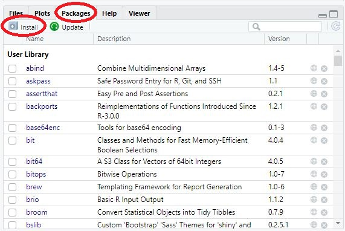
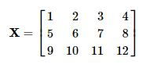
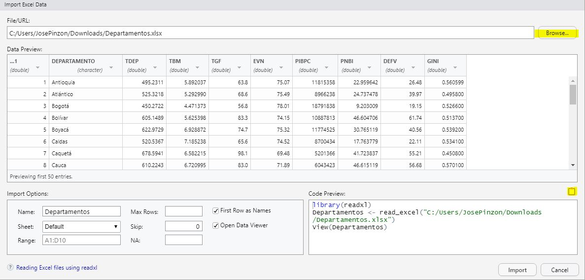
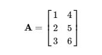
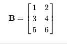

```{r setup, include=FALSE}
knitr::opts_chunk$set(echo = TRUE)
```

\pagebreak


**NOTA ACLARATORIA**: Esta guía aún se encuentra en construcción, no es la versión final, razón por la cual está sujeta a modificaciones.

**Esta guía es exclusivamente para uso pedagógico**

# Introducción.

R es un software, o lenguaje de programación de distribución libre, bajo Licencia GNU. Fue diseñado principalmente para realizar análisis estadísticos y gráficas. Es uno de los lenguajes libres más utilizados en investigación por los estadísticos, puesto que tiene gran relevancia en áreas de Big Data, minería de datos,  predicciones, Inteligencia Artificial. Este software corre en distintas plataformas Linux, Windows, MacOS, entre otros.

A continuación se mencionarán algunas ventajas de trabajar con R.

*	**Código abierto y gratuito:**  Puede ser usado sin restricciones, es un programa distribuido de manera gratuita. La licencia GNU permite usar R para cualquier fin, sin limitaciones, no importando si es para uso personal, académico o comercial.
*	**Manipulación de datos:** : R permite el tratamiento y manipulación de datos con gran facilidad y velocidad. También permite la lectura de archivos provenientes de otros programas como JSON, SPSS, Excel, SAS, STATA, e incluso se puede vincular con SQL.
*	**Automatización de procesos:**  R utiliza un lenguaje de script en lugar de una interfaz gráfica de usuario, por lo que es mucho más fácil de automatizar cosas en R que en Excel, ya que solo se necesita escribir el código una vez, luego de eso se puede ejecutar el código cuantas veces quiera sin necesidad de volver a hacer todo el proceso.

*	**Mayor precisión en cálculos:** El lenguaje de programación R fue creado específicamente para realizar análisis estadístico, por lo que es más preciso para calculos estadísticos y matemáticos avanzados.
*	**Mayor volumen de datos:** R también fue creado para manejar grandes volúmenes de datos, por lo cual no tiene ningún lío cuando se manejan bases de datos grandes.
*	**Análisis estadísticos avanzados:** Como es un programa Open Source cada persona puede contribuir con paquetes, producto de esto se han publicado librerías con funciones específicas atendiendo a las necesidades de los investigadores.
*	**Gráficos avanzados e interactivos:** R dispone de múltiples funciones diseñadas para la representación gráfica de datos, por lo que usted podrá realizar cualquier tipo de gráfico, ya sea básico o de alto nivel.


## R como calculadora.

Un uso de R es como calculadora, a continuación verá un listado con algunos comandos de operaciones básicas que se pueden hacer con el software y posteriormente encontrará ejemplos de operaciones en R.

1. Suma (+)
2. Resta (-)
3. Multiplicación (*)
4. División (/)
5. División entera (%/%)
6. potenciación (ˆ)
7. Raiz Cuadrada (sqrt)
8. Logaritmos (log)
9. Multiplicación de matrices (%*%)
10. Transponer (t())

Para las operaciones entre matrices debe tener en cuenta las reglas del álgebra matricial, por ejemplo: no todas las matrices se pueden sumar entre ellas. 

Para correr los códigos presione las teclas CTRL + ENTER en la fila que desea ejecutar.

```{r, eval=FALSE}
# El numeral se usa para poner un comentario en el código. 
# Lo que se ponga después de "#" no será interpretado por R, será omitido. 
# Hacer comentarios puede ayudar a que el código sea más fácil de entender.

#SUMA
45 + 6 + 89
#RESTA
8 - 9 - 2

#MULTIPLICACION
10 * 5
10 * (-5)

#DIVISION
8 / 3
8 %/% 3   #Division entera

#POTENCIACION
5^2
5**3

#RAIZ CUADRADA
sqrt(25)

#LOGARITMOS
log(10)
``` 

## Instalación de paquetes.

Una de las ventajas de R es que puede ser expandido por paquetes, cada paquete es una colección de funciones diseñadas para atender una tarea específica. En su gran mayoría están almacenados en el CRAN (The Comprehensive R Archive Network), el cual hace la función de servidor, acá encontrará toda la documentación de R, así como de sus paquetes, librerías y funciones. 

Hay paquetes que ya vienen instalados de manera predeterminada, para hacer uso de ellos puede llamarlos con la función **library()**, entre paréntesis deberá colocar la librería que va a utilizar. Este procedimiento se debe realizar siempre que vaya a hacer uso de alguna librería en específico.  

```{r}
library(dplyr) #Librería para manipulación de datos.
```

Si el paquete no viene de forma predeterminada (Como es el caso de dplyr) deberá instalarlo. Hay varias maneras para hacer la instalación de los paquetes. Una de estas es haciendo uso de la interfaz de Rstudio, puede dirigirse a la pestaña "Packages", estando ahí deberá dar click en el botón "Install", luego deberá escribir el paquete que quiere instalar y por último dar click en el botón "Install". Vea las figuras 1 y 2.




Otra manera de hacerlo es por medio de código, utilizando el comando **install.packages()**, entre paréntesis deberá colocar entre comillas el nombre del paquete que desea instalar. 

```{r, eval=FALSE}
install.packages("dplyr")
```

**La instalación del paquete solo debe hacerla la primera vez, después de haberla instalado solo tiene que llamarla usando el comando library() **


## Solicitar ayuda en R.

Si usted desea obtener ayuda o más información sobre alguna función o librería puede hacerlo mediante cógido. Para ello puede emplear la función **help()** especificando el comando sobre el cual quiere solicitar la ayuda. A continuación se solicitará ayuda para la función **class**. La información aparecerá en la pestaña **help**, al lado de la pestaña donde se realizó la intalación de los paquetes.

```{r, eval=FALSE}
help(class)
```

Una forma más abreviada para perdir ayuda es utilizando el signo "?" antes de la función. Si usted quiere información más general o menos específica use "??".

```{r, eval=FALSE}
?class
??class
```


# Tipos de datos en R.

En los lenguajes de programación se encuentran varios tipos de datos. Los mas usuales son estos:

1. Entero.
2. Decimal / Flotante / double
3. Caracter. (Texto / Palabras)
4. Factor (Transformación del caracter) 
5. Lógico. (Verdadero y Falso)

Algunos comandos para concer los diferentes atributos de los objetos son: class(), dim(), length(), entre otros. 
Si requiere cambiar la clase de un objeto basta con ejecutar as.__(). Por ejemplo, si usted quiere cambiar un dato de tipo caracter a tipo factor lo puede hacer de la siguiente manera.
Tipo_factor = as.factor(caracter)

```{r}
class(1L)
class(2.5)
class("Hola mundo")
class(as.factor("Hola mundo"))
class(TRUE)
```


# Estructuras de datos en R.


## Variables.

R permite crear y guardar estructuras de datos, la primera que vamos a desarrollar será la variable. Esta puede ser creada con el operador *Asignar*, el cual se denota como una flecha creada con el signo menos (-) y el simbolo mayor que (>) o menor que (<), dependiendo de la direccion en que asigna el objeto.  

A continuación se tienen unos ejemplos donde se crearán objetos o variables y se les asignará un valor:


```{r}
## Se crean los objetos "estatura" con un valor de 1.85 y "peso" con un valor de 75
estatura <- 1.85
peso <- 75
## Se crean los objetos "n" y "q"
5 -> n
sqrt(64) -> q
```


Usted también puede operar variables, el resultado le aparecerá en la consola:  


```{r, eval=FALSE}
## Operaciones
estatura / peso
estatura + peso
peso * estatura
```
 
Si usted desea guardar esos resultados de alguna operación lo puede hacer creando otra variable. Para saber el valor de su objeto usted puede mirar el entorno o puede llamar a la variable volviendo a escribir el nombre que le asignó:


```{r}
## Guardar variable con un resultado
IMC <- peso/estatura^2
## Para ver el resultado en la consola
IMC
```


## Vectores.

Un vector en R contiene una secuencia finita de valores de un solo tipo, como una secuencia de números o una secuencia de caracteres. 
A continuación verá dos vectores, el primero con datos de tipo numérico y el segundo con datos tipo caracter.


### Creación de vectores.


$$ Vector1 = (1,2,3,4,5,6) $$

$$ Vector2 = (arbol, casa, persona)$$


Se puede utilizar la funcion _c_ para crear vectores, ya que esta permite agrupar un conjunto de datos. Para identificar que tipo de datos contiene cada vector se utilizar la funcion _class_, la cual determina si el vector contiene datos numericos, caracteres o logicos.

```{r}
X <- c(1,2,3,4,5,6)
Y <- c("arbol","casa","persona")
class(X)
```

Recuerde que los vectores permiten solo un tipo de dato, cuando se ponen varios tipos de datos R buscará la manera de transformarlos para que todo quede unificado:

```{r}
v1 <- c(1.7, "a") ## character 
v2 <- c(TRUE, 2) ## numeric
v3 <- c("a", TRUE) ## character
v4 <- 9:29 ## integer 
v5 <- c(1,2,3.5) ## numeric
```


Otra manera de crear vectores es por medio de cadenas o secuencias numericas:

```{r, eval=FALSE}
#Creación de cadenas
1:10 #Secuencia numerica del 1 al 10
10:1 #Secuencia numerica del 10 al 1
-43:-30 #Secuencia numerica de -43 a -30
```

También se pueden crear vectores con el comando **seq**. El primer argumento será el número inicial, el segundo argumento será el numero final, para el siguiente caso se establecerá una secuencia numérica del 1 al 4.

```{r}
seq(1,4)
```

El comando **seq** tiene argumentos adicionales que pueden ser utiles para definir el conjunto de datos de su vector. Un argumento es _len_, el cual permite establecer el número de datos que componen la secuencia, si usted coloca **len = 20**, su secuencia tendrá 20 números. Otro argumento es _by_, con el cual usted indica los saltos que va a tener la secuencia, si usted quiere que su cadena de numeros vaya de 5 en 5 pondrá **by = 0.5**.


```{r}
seq(1,4, len = 20)
seq(1,4, by = 0.5)
```

Para que no se muestren tantos decimales usted puede reondear los resultados con el comando **round**. El primer argumento serán los valores que se quieren redondear y el segundo argumento serán los decimales que usted quiere mostrar. A continuación se creará el vector a y posteriormente se utilizará el comando **round** para redondear los decimales.

```{r}
a <- seq(1,4, len = 20)
round(a,2)
```

Usted también puede sobreescribir un vector u objeto. Si quiere que el vector "a" quede guardado con las modificaciones del round puede hacer lo siguiente:

```{r}
a <- round(a,2)
a
```


### Operaciones con vectores

También se pueden operar vectores: 

```{r}
mi_vector <- c(2,3,6,7,8,10,11)
P <- seq(1,4, len = 7)
mi_vector + P  ## Suma de dos vectores.
mi_vector + 2
mi_vector * 3 
mi_vector > 7
```

### Indexación.

La indexación se usa para ubicar valores en las estructuras de datos. Para los vectores es muy sencillo, lo primero es llamar el nombre del vector, luego se ponen corchetes [], y dentro del corchete se va a colocar la posición del valor que quiere buscar.

Supongamos que quiere saber qué número va en la posición 6 del objeto llamado "mi_vector", para eso haremos lo siguiente:

```{r}
mi_vector[6]
```
El output o salida indica que el elemento 6 del vector es "10".

También puede hacer operaciones con un número ubicado con la indexación.

```{r}
mi_vector[2] + 3
```


**Ejercicio:** Crear un vector que vaya desde -5 hasta 6 y que tenga 7 números. Luego de crear el objeto sumarlo con "mi_vector1" e imprima el resultado con maximo 3 decimales.

La respuesta debería salir así:

$$Vector = (-3.000, -0.167,  4.667,  7.500, 10.333, 14.167, 17.000)$$


## Matrices.

Una matriz es realmente un vector con un atributo adicional (dim) el cual a su vez es un
vector numerico de longitud 2, que define el numero de filas y columnas de la matriz. Una matriz se puede crear con la funcion **matrix**.

### Creación de matrices

En la figura 3 se muestra un ejemplo de una matriz numérica.


Para hacerla en R se puede utilizar el siguiente código. El primer argumento es la secuencia de numeros o valores que se quieren tener en la matriz, seguido por el comando **nrow** con el cual se especifican el número de filas, y por último está el argumento **ncol**, este permite establecer el numero de columnas de la matriz.

```{r}
matrix(1:12, nrow = 3, ncol = 4)
```




Para organizar los valores por filas y que queden como en la figura 4 se va a utilizar el argumento **byrow**. Mire el siguiente código.

```{r}
matrix(1:12, nrow = 3, ncol = 4, byrow = TRUE)
```

Otra manera de crear una matriz es dando los valores apropiados al atributo **dim** (que inicialmente tiene valor NULL):


```{r}
g <- 1:15 #vector
dim(g)
dim(g) <- c(5, 3) #se crea la matriz especificando filas y columnas
g
```

También se pueden crear matrices uniendo varios vectores. A continuación se crearán 4 vectores.

```{r}
vector_1 <- 1:4
vector_2 <- 5:8
vector_3 <- 9:12
vector_4 <- 13:16
```

Ahora se va a utilizar el comando _cbind_, con este comando se van a unir los vectores usando cada uno de ellos como columnas:

```{r}
matriz_v <- cbind(vector_1,vector_2,vector_3,vector_4)
matriz_v
```

O también se puede usar el comando _rbind_ para usar los vectores como filas:

```{r}
matriz_v2 <- rbind(vector_1,vector_2,vector_3,vector_4)
matriz_v2
```

### Indexación

Para ubicar valores dentro de una matriz, lo primero que se hace es llamar la matriz, seguido de [], en estos corchetes se colocará el número de fila y de columna respectivamente.

```{r}
index <- matrix(1:12, nrow = 3, ncol = 4)
index
index[1,3] ## Para ubicar el valor 7, fila numero 1 y columna numero 3
index[3,2] ## Para ubicar el valor 6, fila numero 3 y columna numero 2
```


## DataFrame.

Los dataframe son tipos especiales de objetos en R diseñados para conjuntos de datos que se parecen a las matrices, pero a diferencia de las matrices, las columnas de un marco de datos pueden ser diferentes tipos, como numéricos o de caracteres. 
Se ha visto que un dataframe se crea de manera implicita con la funcion read.table; tambien es posible hacerlo con la funcion data.frame, los vectores incluidos como argumentos deben ser de la misma longitud.

### Crear dataframes.

Un DataFrame puede ser creado uniendo vectores. A continuación se crearán dos vectores y luego se van a unir con la función **data.frame**. Y se utilizará la función class para verificar que el objeto creado es un DataFrame.

```{r}
entero <- c(1:7)
decimal <- c(1.2,2.5,3.2,4.5,5.6,5,3.4)
caracter <- c("Juan","Jose","Laura","Valentina","Valentina","Valentina", "Juana")
mi_df <- data.frame(entero,decimal,caracter)
class(mi_df)
```

### Caracteristicas del DataFrame

Si usted quiere tener una idea de que datos tiene su dataframe puede usar los codigos **head** y **tail**. El comando head le permitirá ver los primeros datos de su base de datos, el primer argumento es el nombre de su dataframe y el segundo elemento es la cantidad de observaciones o filas que desea ver. El comando tail funciona igual que head, pero en vez de mostrar los primeros datos, le imprime las últimas observaciones.

Para ver los nombres de las columnas de su DataFrame utilice el comando **names**, y entre parentesis colocará el nombre de su DataFrame.

Explore los siguientes comandos:

```{r, eval=FALSE}
names(mi_df)
head(mi_df,3)
tail(mi_df,2)
unique(mi_df$caracter) #Valores que puede tener una columna
length(mi_df) # Numero de columnas
nrow(mi_df) # Numero de filas
dim(mi_df) #Numero de filas y de columnas
str(mi_df) # Atributos de cada variable / columna
```

Si usted desea ver información de alguna variable o columna en especifico, puede vincular la base de datos y la variable con el signo \$. En primer lugar usted colocará el dataframe que quiere trabajar, seguido del singo \$ y luego el nombre de la variable que quiere seleccionar: 

```{r}
min(mi_df$entero) #Numero máximo de la variable seleccionada
max(mi_df$decimal) #Numero mínimo de la variable seleccionada
```


### Modificar dataframes.

Se pueden agregar nuevas variables o vectores a un dataframe ya creado. A continuación se mostrará un ejemplo:

Lo primero que se va a hacer es crear un vector con ciudades. Recuerde que para unir vectores tienen que tener la misma longitud, es decir, el mismo número de filas.

Para agregar el vector al dataframe: Lo primero es llamar al DF, luego se pondrá el signo \$ y posteriormente se escribirá el nombre de la columna que usted quiere crear, por último le asignará el vector creado.

```{r}
## Crear vector
Ciudades <- c("Bogota","Medellin","Cartagena", "Cali", "Leticia", "Pereira", "Barranquilla")
## Agregar al DF
mi_df$CIUDADES <- Ciudades
mi_df
```


#### Cambiar nombre de columnas:

Para cambiar el nombre de las columnas se emplea el codigo **names** de la siguiente manera.


```{r}
## Cambiar todos los nombres de las columnas.
names(mi_df) = c("Columna1","Columna2","Columna3","Columna4")
mi_df
## Cambiar el nombre de alguna columna en específico.
names(mi_df)[1] = "Entero"
mi_df
```


### Indexacion


La indexación para los dataframes funciona exactamente igual que para las matrices. Se ponen corchetes [] después del nombre de su data frame y dentro de ellos coloca el número de fila y columna del valor que quiere seleccionar.

Si usted quiere seleccionar una fila completa deja el primer argumento vacío, si quiere mirar todas las columnas deja el segundo argumento vacío.

Explore los siguientes comandos:

```{r, eval=FALSE}
mi_df[1,3]
mi_df[,4] #Todas las filas
mi_df[2,] #Todas las columnas
mi_df[,-4] #Quitar columnas
mi_df[-3,] #Quitar filas
```


# Importar bases de datos.

Por defecto, R ya trae instaladas algunas bases de datos o DataFrames que pueden ser utilizadas por los usuarios. Para acceder a estas librerías simplemente basta con escribir el nombre del dataset. Si usted desea conocer cuales son las bases de datos que puede manejar desde R puede llamar al paquete de la siguiente manera **datasets::**, de inmediato le aparecerá una lista con todos los archivos que puede mirar. Si usted desea guardar uno de estos objetos en el entorno, puede hacerlo con el comando _data ()_, entre parentesis colocará el nombre del dataset. Otra manera de hacerlo es asignandole un nombre seguido por el simbolo de asignación.


```{r,eval=FALSE}
#Para ver el menu de datasets.

datasets::

```

```{r}
#Para guardarlo en el entorno

data("airquality")
head(airquality,3)

base <- datasets::iris
head(base,3)

```


Otra ventaja de R es la integración de Api's. Las cuales se vinculan con otras páginas o servidores para descargar información.

Para este caso vamos a descargar de la página _yahoo finance_ información de la acción de apple desde el primero de enero del 2015. Para esto es necesario llamar la librería **quantmod**, si no la tiene, por favor descárgela y la instala. 


Para obtener los datos se usa la función **getsymbols**, el primer argumento será el ticket o nombre que represente la acción, para este caso es AAPL, con argumento _src_ indicará la fuente o página de donde quiere descargar la información, si lo que quiere descargar tiene periodicidad colóquelo con el argumento _periodicity_, de lo contrario omítalo, y por último tiene los argumentos _from_ y _end_, con los cuales podrá definir fecha de inicio y fecha final respectivamente.

```{r,message=FALSE}

library(quantmod) ## Se llama a la librería

getSymbols("AAPL",src = "yahoo", periodicity = "daily", from = "2015/01/01")
head(AAPL,3)
```


R también permite trabajar con varios tipos de archivo, se pueden importar archivos provenientes de programas como SPSS, SAS, STATA, Excel, entre otros.
Para importar estos archivos debe dirigirse al entorno, allí encontrará una opción que dice _Import Dataset_, al seleccionarla le aparecerá una lista, con algunos de los formatos de archivo que puede importar. Mire la Figura 5.


Las dos primeras opciones, por lo general se usan para importar archivos **txt** y **csv**, la tercera opción es para importar archivos de excel o archivos **.xlsx**. 

Para importar los archivos seleccione la opción correspondiente, a continuación le aparecerá una nueva ventana, mire la figura 6. Lo primero que debe hacer es darle al botón **Browse...**, luego deberá buscar y seleccionar lo archivo. Cuando lo haya seleccionado R le mostrará una vista previa de los datos del archivo. Cuando confirme que toda la información está correcta copie el código que aparece en la parte inferior derecha (Puede hacerlo dando click en el logo resaltado), le dará importar y por último, pegará el código copiado en su script de R




```{r}
library(readxl)
Departamentos <- read_excel("C:/Users/JosePinzon/Downloads/Departamentos.xlsx")
head(Departamentos)
```


# EJERCICIOS.

Cree un script o archivo en R y dentro de el realice los siguientes ejercicios.

### Operaciones:

1. Construya un código que realice las siguientes
operaciones:
* 10 + 5
* 4 * 8
* 3/5
* 4^2
* Raiz cuadrada de 81


### Vectores 


2. Guarde un vector que contenga los numeros 1,3,6 y numero favorito 
3. Guarde un vector que contenga los números del 1 al 100, dando saltos de 5 en 5.
4. Construya un vector que contenga las letras de su nombre. 
5. Cree dos vectores de longitud 30 cada uno y súmelos.
6. Construya un código que le sume 1 a elemento del punto 2 y lo sobreescriba.
7. Elimine el vector del punto 4 con el comando rm.

### Matrices

8. Cree las siguientes matrices.




9. Cree otro objeto con la suma de las dos matrices creadas en el punto anterior.
10. Haga un código que ubique el número 5 de las dos matrices.

### DataFrame.

11. Importe un dataframe de R y mire sus características (Tipo de variables, numero de columnas, numero de filas, nombre de las columnas)


**NOTA ACLARATORIA**: Esta guía aún se encuentra en construcción, no es la versión final, razón por la cual está sujeta a modificaciones.

**Esta guía es exclusivamente para uso pedagógico**

