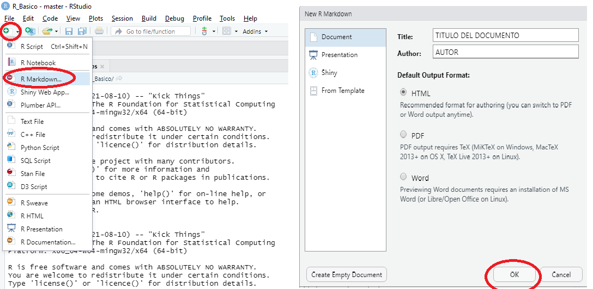

```{r setup, include=FALSE}
knitr::opts_chunk$set(echo = TRUE)
```
  

## R Markdown

Uno de los formatos que contiene RStudio es R Markdown, acá se generan documentos mediante una interfaz que permite entrelazar texto narrativo y código para producir una salida con formato elegante. R Markdown permite variados formatos de salidas, incluidos HTML PDF, PDF, MS Word, diapositivas HTML, artículos científicos, entre otros.

Los archivos R Markdown están diseñados para usarse con el paquete "**_rmarkdown_**". Por esto, primero se debe instalar el paquete rmarkdown, una forma de hacerlo es ingresando el siguiente código.

```{r RMARK, eval=FALSE}
install.packages("rmarkdown")
```


### Crear R Markdown

Con el paquete rmarkdown instalado puede crear un nuevo archivo con extensión .Rmd, para hacer esto debe ir a las opciones que aparecen arriba de la interfaz "Rstudio", dar click en las opciones "File" -> "New File" -> "R markdown", también puede hacerlo como en el ejemplo de la figura 1. Luego de esto Rstudio le solicitará título, autor y formato de salida, ingrese en formato de salida html y de clic en **OK**. Si prefiere un pdf debe tener instalado **LATEX** en su equipo. 

{height=280}


Lo primero es el encabezado de su informe el cuál contiene: título, autor, fecha y formato de salida. Además va a encontrar un primer código entre tíldes o en un "Chunk", dicho código debe estar en el encabezado de todos los documentos. Mire la Figura 2. 


El "Chunk" es el espacio donde usted le indicará a Rstudio el código o instrucción que quiere llevar a cabo. Lo que se encuentre por fuera de este chunk será tomado como texto.  En la Figura 1 se encuentran resaltados los chunks y la manera de crearlos. 


### Generar el informe

Por defecto R le entrega un ejemplo, para obtener el informe o documento y ver el resultado por favor dar click en Knit o Ctrl+Shift+k. 

- Knit: "tejer el archivo". El rmarkdown paquete llamará al "knitr" paquete. knitr ejecutará cada fragmento de código  R en el documento y agregará los resultados del código en los espacios correspondientes.

## Comando message

Algunas veces, cuando se ejecuta un código o se carga una librería en la consola aparece un mensaje o una advertencia, estos mensajes también pueden salir en el informe creado con Rmarkdown. Si usted no desea que aparezca ese mensaje en el documento usted puede utilizar el comando ***message=FALSE*** para ocultarlo. Este comando se coloca en donde se forma el chunk, de la siguiente manera ```{r, message=FALSE}. Mire la figura 3.


A manera de ejemplo se va a cargar la libreria _dplyr_ dos veces, ya que por lo general esta liberia muestra un mensaje, en la primera vez no se incluirá el comando _message_, mientras que en la segunda sí se incluirá.

1. Acá **NO** se colocó el comando __message__:  

```{r}
library(dplyr)
```

2. Acá **SÍ** se colocó el comando __message__:  

```{r, message=FALSE}
library(dplyr)
```


## Formato

Por fuera de los chunks, donde se coloca el texto del documento se maneja un lenguaje llamado "markdown", esta es una forma de agregar formatos a texto, algunos formatos son: encabezados, negritas, cursivas, listas, entre otras. A continuación veremos como aplicar esto a nuestro documento creado con rmarkdown.

### Cursiva

Para poner el texto en cursiva utilizamos * o _ antes y después del texto. \_cursiva_ \*cursiva*

Resultado: _cursiva_

### Negrita

Para poner el texto en negrita utilizamos ** o __ antes y después del texto. \_\_negrita_ \*\*negrita**  

Resultado: **negrita** 


### Superindices

Los superindices se pueden crear utilizando ^ antes y después del número. \^3^

Resultado: superindice^3^ 

### Tachado

Si quiere tachar alguna palabra o algun texto coloque ~~ antes y después del texto. \~\~tachado~~

Resultado: ~~tachado~~

### Enlaces

Para colocar enlaces, ponga el link de la siguiente manera \<enlace>  

Resultado: <http://www.rusersgroup.com>

### Viñetas y listas

En Rmarkdown también se pueden crear viñetas y listas. Si quiere hacer una enumeración es suficiente con escribir comenzado párrafo: 1. carro. (enter) 2. casa
(enter) 3. perro. Si lo que desea es viñetas en lugar de los números utilice el signo - o *.


\- Elemento  

\- Elemento  

\- Elemento  


1. Elemento
2. Elemento
3. Elemento

1) Elemento
2) Elemento
3) Elemento

Otra forma de crearlos es de la siguiente manera:

\* Elemento(enter)  
\* Elemento(enter)  
    + Subelemento(enter)  
    - Desagregación(enter)  
\* Elemento

Para que resulte así:

* Elemento
* Elemento
    + Subelemento
        - Desagregación
* Elemento


### Titulos y subtitulos

Para agregar un título utilice el símbolo # al principio de título, para agregar subtítulos utilice ## al principio del subtítulo, al agregar # va a ir agregando secciones y subsecciones

# Esto es un H1 - 1 signo \#

## Esto es un H2 - 2 signos \#

### Esto es un H3 - 3 signos \#

#### Esto es un H4 - 4 signos \#

##### Esto es un H5 - 5 signos \#


**NOTA ACLARATORIA**: Esta guía aún se encuentra en construcción, no es la versión final, razón por la cual está sujeta a modificaciones.

**Esta guía es exclusivamente para uso pedagógico**
